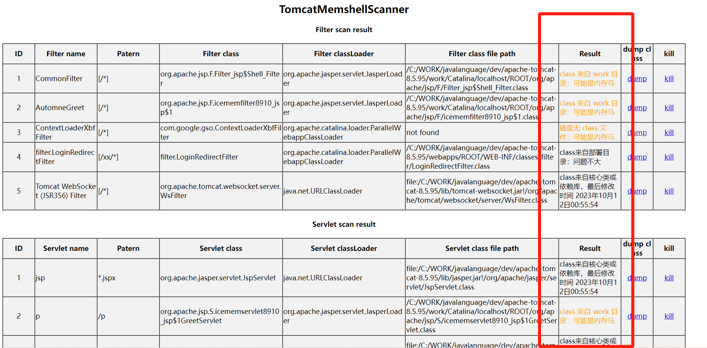
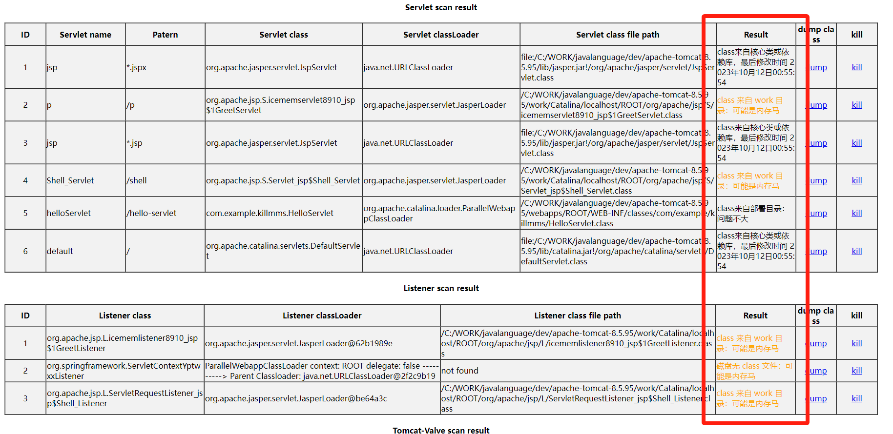
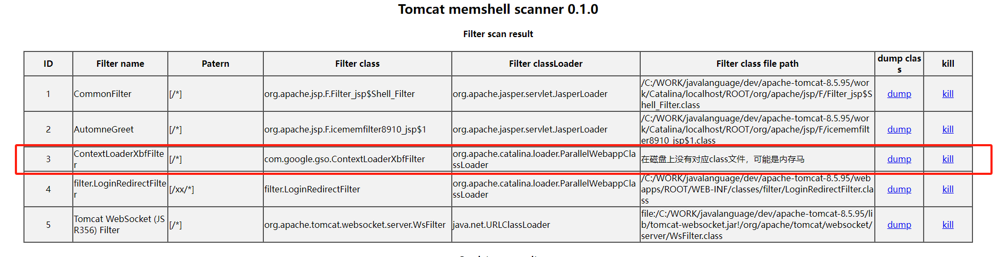
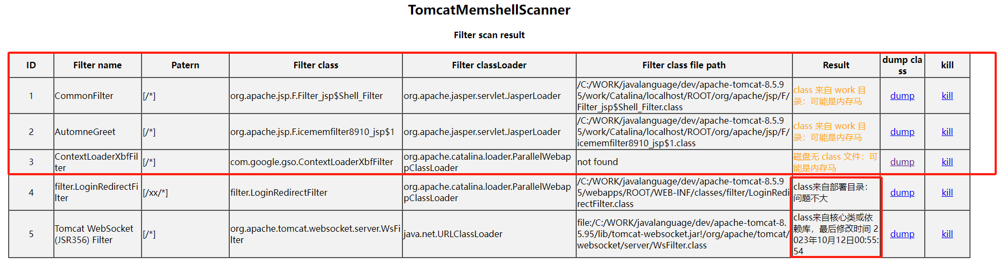
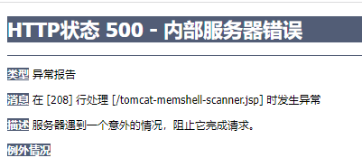
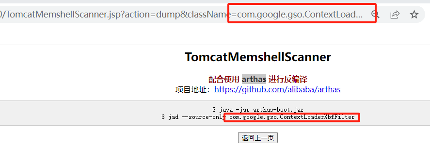

# TomcatMemshellScanner
Tomcat内存马查杀工具

原项目：https://github.com/c0ny1/java-memshell-scanner/

根据对这个项目以及内存马的学习，我发现此项目定位内存马存在缺陷以及诸多BUG

为此在这个工具的基础上：

###### 添加了新的确认逻辑

​	根据Tomcat部署目录与工作目录的区别

​	可确认与查杀(Filter、Servlet、Listener、Valve)内存马，如通过热门工具https://github.com/pen4uin/java-memshell-generator生成的内存马、只实现命令执行功能的内存马

对比

**原项目**

​	 

可以看到5个filter中除3号可以确认为内存马，其余内存马1和2均无法确认

**此项目**

Filter内存马全部找出，并且对其余情况做出提示提供分析

###### 支持类型

​	合并了几位师傅对于原项目不同内存马类型的拓展与完善（@ruyueattention、@tyskill、@zzhorc）

- Filter
- Servlet
- Listener
- Valve
- Timer
- Websocket
- Upgrade
- ExecutorShell

###### 问题和优化

​	1.修复了无class落地内存马，dump触发500报错的问题

 

​		为什么会这样？简单来说，该类也就是内存马是通过 `defineClass` 动态注入的，仅存在于内存中，JVM 没有保存它的 `.class` 文件或记录，在`line#210# Repository.lookupClass()` 无法获取其字节码，返回了`null`调用 `getBytes() `时触发了 `NullPointerException`，导致 HTTP 500 错误

​	我的解决方法是直接指向**arthas**，并提供需要的命令，反编译确认后再回来kill，**安服友好这一块**

  

 

2. 修复了kill时浏览器概率报错`ERR_INVALID_RESPONSE`

3. 优化了一些展示以及处理的小细节

   

   

   ##### 另：

   工具是近期本人的一点学习总结记录

   对小众request hook点、agent注入的内存马等等等 无用

   真实场景请联系专业人员分析处理，使用带内存马检测功能的商业产品

   

   ##### 感谢

   @CHATGPT、@宅度青年、@okgo、@pen4uin

   对我学习过程中的答疑解惑和帮助，谢谢你们
   
   

